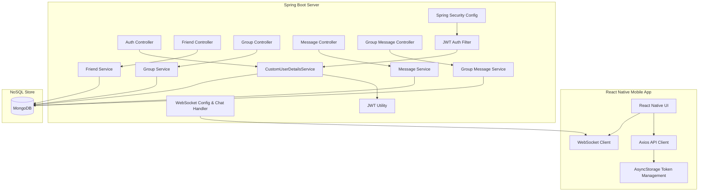

# Howudoin - Real-Time Chat & Messaging Application

Howudoin is a full-stack, real-time messaging application featuring direct messaging, friend requests, group management, and group chats. The system is split into a robust Spring Boot REST + WebSocket backend and a polished React Native mobile frontend.

---

## 🏗️ Project Architecture



### 1. Backend Service (`howudoin`)
* **Framework**: Spring Boot 3.3.5, Java 17
* **Security**: Stateless authentication using Spring Security and JSON Web Tokens (JWT). All APIs except public authentication endpoints are secured with custom roles (`ROLE_USER`).
* **Database**: MongoDB (Spring Data MongoDB) for storing users, messages, group definitions, and friend requests.
* **Real-time communication**: WebSocket support via a TextWebSocketHandler endpoint (`/ws/messages`) that broadcasts messages to connected sessions.

### 2. Frontend Application (`HowudoinApp`)
* **Framework**: React Native 0.76.5, TypeScript enabled
* **Navigation**: React Navigation (Stack Navigator) with automatic session expiry redirection.
* **Storage**: Local session state managed using `@react-native-async-storage/async-storage` (stores accessToken, refreshToken, userId, and userEmail).
* **API Client**: Axios instance (`ApiService.js`) with request and response interceptors to automatically attach Bearer JWTs and perform token refresh flow dynamically when an access token expires.

---

## 📋 Prerequisites

Ensure you have the following installed on your developer machine:
* **Java Development Kit (JDK)**: Version 17
* **Node.js**: Version 18 or higher (LTS recommended)
* **MongoDB**: A local instance running on port `27017`
* **Mobile Development SDKs**:
  * **iOS**: macOS with Xcode (and CocoaPods)
  * **Android**: Android Studio with an Android Emulator and Android SDK configured

---

## 🛠️ Step-by-Step Installation & Setup

### Step 1: Start MongoDB
Ensure MongoDB is running locally. You can start it via your system services or run it in Docker:
```bash
docker run -d -p 27017:27017 --name howudoin-mongo mongo:latest
```

### Step 2: Configure & Start Backend
1. Open the `/howudoin` folder.
2. Edit `/howudoin/src/main/resources/application.properties` to configure settings if necessary:
   ```properties
   spring.data.mongodb.uri=mongodb://localhost:27017/howudoin
   server.port=8080
   jwt.secret=ThisIsASecretKeyThatIsAtLeast32BytesLong!
   jwt.expiration=86400000
   ```
3. Make the Gradle wrapper executable (macOS/Linux):
   ```bash
   chmod +x gradlew
   ```
4. Build the application:
   ```bash
   ./gradlew clean build -x test
   ```
5. Run the Spring Boot application:
   ```bash
   ./gradlew bootRun
   ```
   The backend will start listening on `http://localhost:8080`.

### Step 3: Configure & Start Frontend
1. Open the `/HowudoinApp` folder.
2. Install the JavaScript dependencies:
   ```bash
   npm install
   ```
3. **Configure API URL**: Open `/HowudoinApp/src/config.js` and set the backend host:
   * **iOS Simulator / Host Browser**: Use `http://localhost:8080` (default).
   * **Android Emulator**: Change it to `http://10.0.2.2:8080`.
   * **Physical Device**: Change it to your computer's local network IP (e.g., `http://192.168.1.50:8080`).
4. Run the Metro bundler:
   ```bash
   npm start
   ```
5. Run on your target platform in another terminal window:
   * **iOS**: `npm run ios` (or `npx react-native run-ios`)
   * **Android**: `npm run android` (or `npx react-native run-android`)

---

## 🔗 Key API Endpoints & Routes

All endpoints except `/auth/**` require a valid JWT header (`Authorization: Bearer <accessToken>`).

### 🔑 Authentication (`AuthController`)
| HTTP Method | Endpoint | Request Body | Description |
| :--- | :--- | :--- | :--- |
| `POST` | `/auth/register` | `{"email": "...", "password": "..."}` | Register a new user account |
| `POST` | `/auth/login` | `{"email": "...", "password": "..."}` | Login to retrieve tokens & userId |
| `POST` | `/auth/refresh` | `{"refreshToken": "..."}` | Obtain a new short-lived access token |

### 👥 Friend Management (`FriendController`)
| HTTP Method | Endpoint | Query / Path | Description |
| :--- | :--- | :--- | :--- |
| `POST` | `/api/friends/add` | Body: `{"senderId": "...", "receiverId": "..."}` | Send a pending friend request |
| `GET` | `/api/friends/requests/{userId}` | Path variable `userId` | Get pending requests for a user |
| `PUT` | `/api/friends/request/{id}` | Path variable `id`, Param `status` | Accept (`ACCEPTED`) or Reject (`REJECTED`) a request |
| `GET` | `/api/friends/list/{userId}` | Path variable `userId` | Retrieve list of accepted friends |
| `GET` | `/api/friends/details/{friendId}` | Path variable `friendId` | Retrieve details for a specific friend |

### 💬 Messaging (`MessageController` & `GroupMessageController`)
| HTTP Method | Endpoint | Description |
| :--- | :--- | :--- |
| `POST` | `/api/messages/send` | Send a direct message to a friend |
| `GET` | `/api/messages/conversation/{userId}/{friendId}` | Fetch full direct message history |
| `POST` | `/api/group-messages/send/{groupId}` | Send a message to a group |
| `GET` | `/api/group-messages/{groupId}` | Fetch chat message history for a group |

### 👥 Groups (`GroupController`)
| HTTP Method | Endpoint | Description |
| :--- | :--- | :--- |
| `POST` | `/api/groups/create` | Create a new group chat with a name and initial members |
| `GET` | `/api/groups` | List all groups |
| `GET` | `/api/groups/list/{userId}` | List all groups that a specific user belongs to |
| `GET` | `/api/groups/details/{groupId}` | Get details & member listing for a group |

---

## 🛠️ Verification & Testing

### Running Tests
To verify changes and confirm backend tests pass successfully:
```bash
cd howudoin
./gradlew test
```

### Static Code Analysis
To run the React Native linter and check for syntax or styling issues:
```bash
cd HowudoinApp
npm run lint
```

---

## 💡 Troubleshooting

* **Android connection error**: If the app fails to connect to the backend on Android, ensure your IP in `/HowudoinApp/src/config.js` is set to `http://10.0.2.2:8080` (which is the special IP pointing to the development machine's localhost from the emulator).
* **JWT Expiration Loops**: If you receive a session expiration warning, make sure your backend time matches the host time. The frontend automatically handles 401 token expiry responses by calling `/auth/refresh` behind the scenes.
* **MongoDB connection failure**: Ensure that the database is running on the default port `27017`. Check backend logs for `MongoSocketOpenException`.
